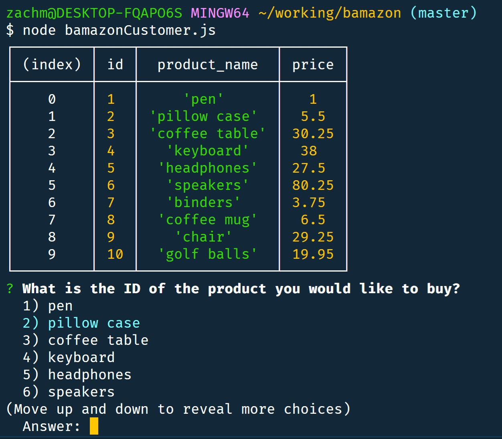
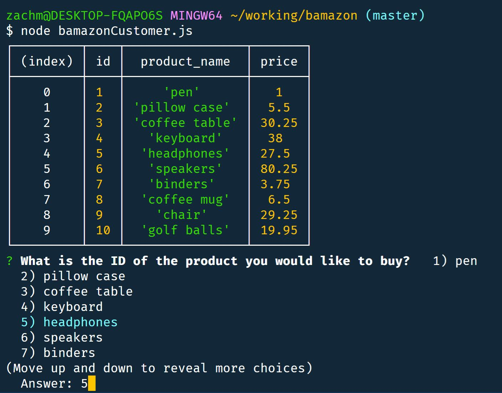
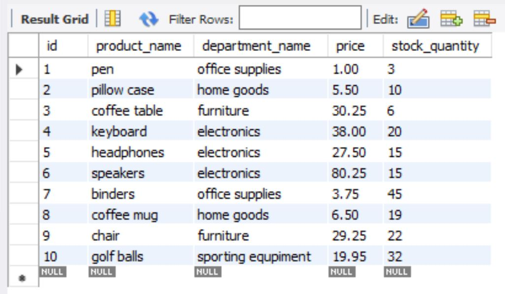
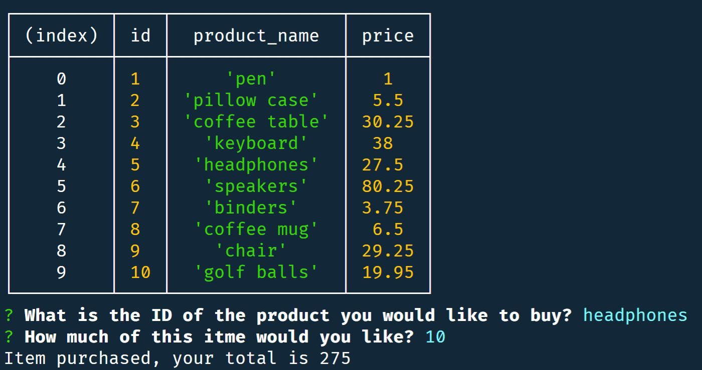
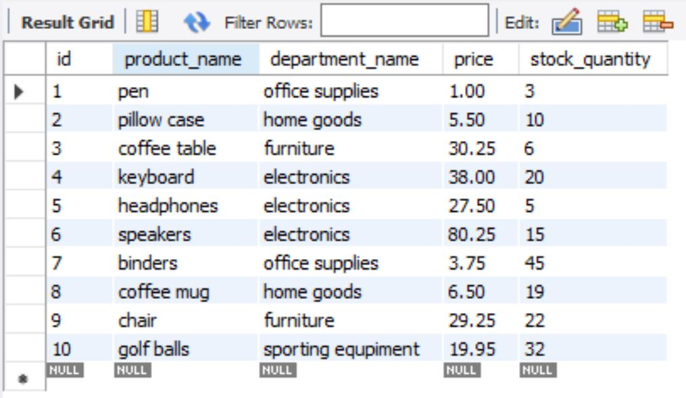
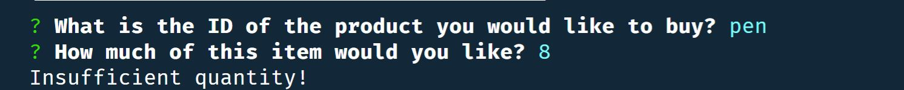

# Bamazon
### Bamazon is an Amazon-like storefront that mimics selling a variety of items kept in a MySQL database. The app will take in orders from customers and deplete stock from the store's inventory.

### Getting Started
* To start the app type "node bamazonCustomer" into the terminal

### Using Bamazon
* Once you have entered the node command you will see a table of products displayed
* To choose one of the products you can either enter the id of the item or navagate the list with your arrow keys and selected by pressing enter

* Once you have choosen an item you will be prompted for the quantity of the item you would like to purchase

* If the quantity of the item you have selected is in stock bamazon will let you know you have purchased your item and the total.

    MYSQL Database before purchase
    

    The app lets you know you have purchased your selected item and gives you a total
    

    MYSQL Database after purchase -- notice the decrease of 10 in the stock_quantity column for headphones
    
* However, if the amount of stock of the item is less than the amount requested you will be told there is insufficient quantity

    MYSQL Database showing a quantity of only 3 pens in stock
    

    If insufficent quantity of stock is available the user is prompted
    

* In either case the user will be prompted to continue shopping

